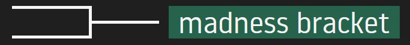
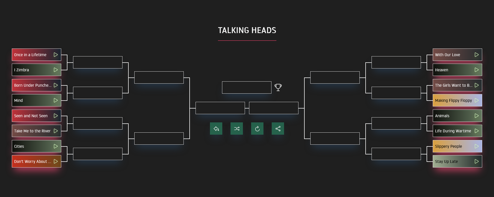
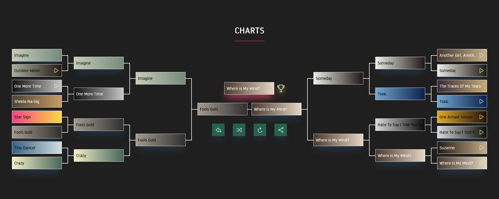
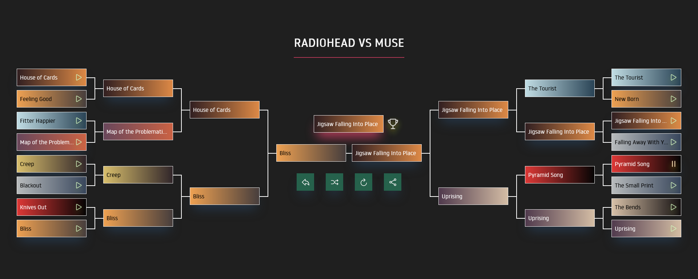

[`madnessbracket.art`](https://madnessbracket.art) is a website where you can generate a tournament bracket for your favorite songs.

### Features

---

✨ **Universal**

It is no longer _just Kanye_ Madness Bracket. Billie Eilish? Kendrick Lamar? David Bowie? You name it.

🤝 **Shareable**

_Any progress_ can be saved: whether you've completed the bracket or just started out. Be sure to share your bracket wherever you like!

🦚 **Stylish** (well, it depends)

The site will render a _familiar_ gradient for every track. You've guessed it right — these are the colors of the album the track is coming from.

🧼 **Clean**

Tracks should hopefully be void of the infamous Spotify tags (remastered, deluxe, anniversary, etc.).

### Usage

---

🔎 You can opt to search for _any artist you like_, or check out the _premade categories_ — madnessbracket.fm will do the rest for you!

☑️ The site will generate a semi-random tournament bracket, i.e. the algorithm will most likely create interesting match-ups.

🎵 If you're not sure which track to advance, you can have a listen — most tracks have a preview button — all thanks to Spotify's 30-second previews.

---

Sneak peek at what _your madness bracket_ might look like:

#### Artist

`# Talking Heads`

#### Charts

`# NME's 500 Greatest Songs of All Time`

#### Secret

`Weekly special theme. # This week it's artists battle.`

### Acknowledgements

---

The project wouldn't be possible without these incredible resources: The MetaBrainz Foundation, Last.fm, Discogs, and Spotify.
Surely, I must mention _the origin_ — the original Kanye Madness Bracket (as per Carrington Harrison's [tweet](https://twitter.com/cdotharrison/status/972880654277992450?lang=en) that went viral within the music community).

### Contributing

---

Any feedback is appreciated. If you have any suggestions or found a bug, you can create an appropriate issue here, on github, or mail me at support@madnessbracket.fm.
You can also support the project via [buying me a tea 🍵](https://www.buymeacoffee.com/seismo).
